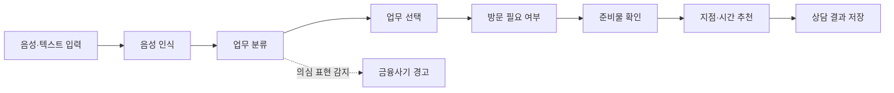

# 어부바

> 어르신 부담 바로 덜기

어부바는 사용자가 은행 업무를 평소 쓰는 말로 설명하면 방문 필요 여부와 준비물, 방문할 지점과 추천 시간을 차례로 안내하는 시니어 친화형 웹 서비스입니다.

이 저장소는 사용자 인증, 음성 인식, 은행 업무 분류, 금융사기 의심 표현 감지, 준비물 체크리스트와 지점 추천 기능을 제공하는 Spring Boot 백엔드입니다.

[서비스 바로가기](https://eobuba-frontend.vercel.app) · [Organization](https://github.com/eobuba-official) · [Frontend](https://github.com/eobuba-official/frontend)

## 주요 기능

| 기능 | 설명 |
| --- | --- |
| 사용자 인증 | 휴대전화 인증과 회원가입 흐름을 제공하고 JWT를 통해 사용자를 인증합니다. |
| 음성 인식 | 업로드된 음성을 NAVER CLOVA CSR로 변환하며, 오류 발생 시 브라우저 음성 인식 결과를 활용합니다. |
| 은행 업무 분류 | 사용자의 자연어 입력을 Gemini API로 분석해 은행 업무와 후보를 분류합니다. |
| 방문 필요 여부 판단 | 사용자가 선택한 업무를 기준으로 은행 방문 필요 여부를 안내합니다. |
| 준비물 체크리스트 | 사용자 조건에 따른 추가 질문을 제공하고 맞춤형 준비물을 구성합니다. |
| 지점·시간 추천 | 업무 처리 가능 여부, 거리와 예상 대기시간을 기준으로 방문 후보를 추천합니다. |
| 금융사기 경고 | 기관 사칭, 안전계좌 요구, 비밀 유지, 원격 제어와 긴급 압박 등의 의심 표현을 감지합니다. |
| 상담 이력 관리 | 사용자의 상담 결과와 방문 준비 정보를 저장하고 조회합니다. |

## 처리 흐름



## Tech Stack

| Category | Technologies |
| --- | --- |
| Core |   |
| Data |   |
| Auth · API |   |
| AI · Speech |   |
| Test |   |
| Infrastructure |    |

## 주요 API

| Method | Endpoint | 설명 |
| --- | --- | --- |
| `GET` | `/api/health` | 서버 상태 확인 |
| `POST` | `/api/v1/auth/sms/request` | 휴대전화 인증번호 요청 |
| `POST` | `/api/v1/auth/sms/verify` | 휴대전화 인증번호 확인 |
| `POST` | `/api/v1/auth/signup` | 회원가입 |
| `GET` | `/api/v1/task-types` | 은행 업무 목록 조회 |
| `POST` | `/api/v1/speech/transcriptions` | 음성 파일 인식 |
| `POST` | `/api/v1/analyze` | 자연어 입력 분석 및 업무 분류 |
| `POST` | `/api/v1/consultations/{consultationId}/task-selection` | 상담 업무 선택 및 방문 여부 판단 |
| `GET` | `/api/v1/consultations/{consultationId}/checklist/questions` | 조건형 준비물 질문 조회 |
| `PUT` | `/api/v1/consultations/{consultationId}/checklist/answers` | 준비물 질문 답변 저장 |
| `GET` | `/api/v1/consultations/{consultationId}/checklist` | 최종 준비물 체크리스트 조회 |
| `GET` | `/api/v1/branches/recommendations` | 방문 지점과 시간 추천 |
| `GET` | `/api/v1/users/me/consultations` | 사용자 상담 이력 조회 |

전체 API 명세는 서버 실행 후 Swagger UI에서 확인할 수 있습니다.

```text
http://localhost:8080/swagger-ui.html
```

## 공통 응답 형식

API 응답은 `success`, `data`, `error` 구조를 사용합니다.

```json
{
  "success": true,
  "data": {},
  "error": null
}
```

## 시작하기

### 요구 사항

- Java 17
- MySQL 8.0
- Google Gemini API 키
- NAVER CLOVA CSR 인증 정보

### 로컬 설정

예제 설정 파일을 복사합니다.

```bash
cp src/main/resources/application-local.properties.example \
  src/main/resources/application-local.properties
```

생성된 `application-local.properties`에 로컬 환경의 값을 설정합니다.

```properties
spring.datasource.username=root
spring.datasource.password=YOUR_MYSQL_PASSWORD

abuba.auth.jwt-secret=YOUR_RANDOM_SECRET_AT_LEAST_32_CHARS
abuba.auth.expose-mock-code=true

piggyback.integrations.gemini.api-key=${GEMINI_API_KEY:YOUR_GEMINI_API_KEY}

piggyback.integrations.clova-csr.api-key-id=YOUR_CLOVA_API_KEY_ID
piggyback.integrations.clova-csr.api-key=YOUR_CLOVA_API_KEY
```

실제 인증 정보가 포함된 로컬 설정 파일은 저장소에 커밋하지 않습니다.

### 실행

```bash
SPRING_PROFILES_ACTIVE=local ./gradlew bootRun
```

서버는 기본적으로 다음 주소에서 실행됩니다.

```text
http://localhost:8080
```

## 테스트

일반 단위·통합 테스트를 실행합니다.

```bash
./gradlew test
```

실제 Gemini API를 사용하는 업무 분류 회귀 테스트는 별도로 실행합니다.

```bash
GEMINI_API_KEY=YOUR_GEMINI_API_KEY ./gradlew geminiRegressionTest
```

## 프로젝트 구조

```text
src/
├── main/
│   ├── java/com/piggyback/backend/
│   │   ├── checklist/        # 조건형 준비물 체크리스트
│   │   ├── classification/   # 업무 분류와 금융사기 감지
│   │   ├── common/           # 공통 응답, 인증과 예외 처리
│   │   ├── config/           # 애플리케이션 설정
│   │   ├── domain/           # 인증, 사용자, 상담과 업무 도메인
│   │   ├── recommendation/   # 지점과 방문 시간 추천
│   │   ├── speech/           # CLOVA CSR 음성 인식
│   │   └── visit/            # 방문 판단 관련 기능
│   └── resources/            # 환경 설정
├── test/                     # 단위·통합 테스트
└── geminiRegressionTest/     # Gemini API 회귀 테스트
```

## 배포 구성

프로덕션 환경은 GitHub Actions를 통해 Docker 이미지를 빌드하고 AWS EC2에 배포합니다. EC2에서는 Docker Compose로 Spring Boot, MySQL과 Nginx를 함께 실행합니다.
